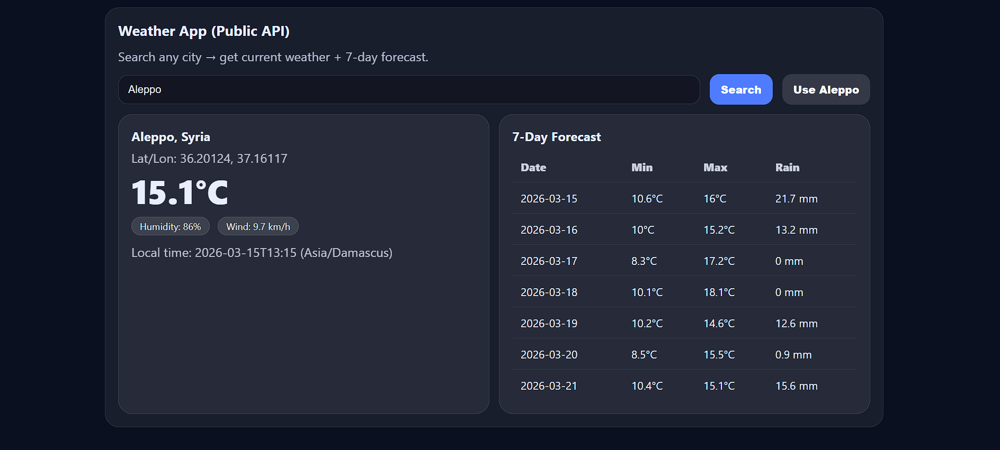

# 🌦 Weather App



A simple and modern weather application that allows users to search for any city and view the current weather along with a 7-day forecast.

---

## 🚀 Features

- Search weather by city name
- Current temperature, humidity, and wind speed
- 7-day weather forecast
- Loading indicator while fetching data
- Error handling for invalid cities or network issues
- Responsive UI for desktop and mobile

---

## 🛠 Tech Stack

- HTML5
- CSS3
- JavaScript (ES6+)
- Open-Meteo API
- Geocoding API

---

## 🌍 How It Works

1. The user enters a city name
2. The app uses the **Geocoding API** to get the city's coordinates
3. It then calls the **Open-Meteo API** to fetch weather data
4. The results are rendered dynamically in the UI

---

## ▶️ Run the Project

Clone the repository:

```bash
git clone https://github.com/codewithkamikaze/Weather-App.git
```

Open the project folder and run:

```bash
index.html
```

in your browser.

---

## 📚 What I Learned

- Working with public APIs
- Fetching and handling JSON data
- Async / Await in JavaScript
- DOM manipulation
- Building responsive interfaces

---

## 📄 License

This project is open source and free to use.
